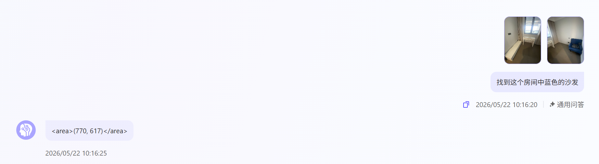
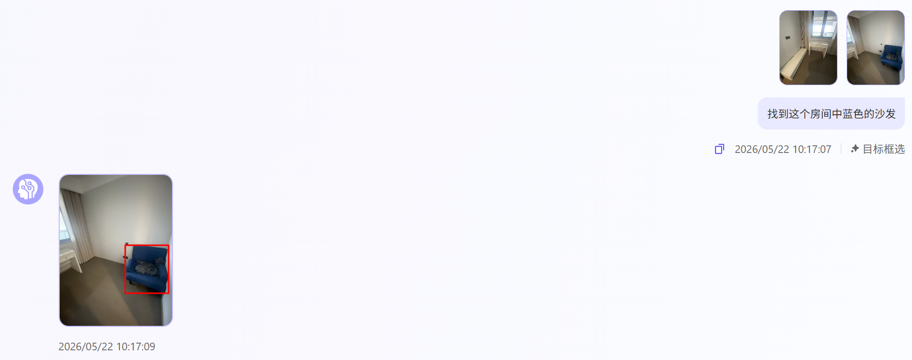
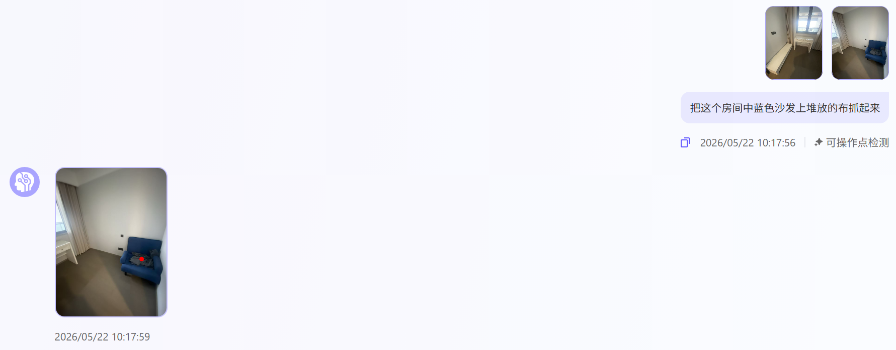
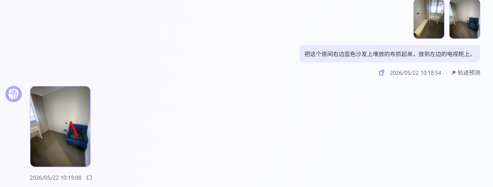

# Task 03 演示实操学习记录

课程链接：[Task 03_演示实操 - 从想法到实现](https://github.com/datawhalechina/every-embodied/blob/main/16-%E4%B8%93%E9%A2%98%E7%BB%84%E9%98%9F%E5%AD%A6%E4%B9%A0/01-%E8%BE%BE%E6%91%A9%E9%99%A2%E7%BB%84%E9%98%9F%E5%AD%A6%E4%B9%A0/Task%2003_%E6%BC%94%E7%A4%BA%E5%AE%9E%E6%93%8D%20-%20%E4%BB%8E%E6%83%B3%E6%B3%95%E5%88%B0%E5%AE%9E%E7%8E%B0.md)

## 一、实操对象与选择理由

这次我从乐云平台的模型广场进入，选择预置模型 **RynnBrain** 做技能调试。选择它的原因是：RynnBrain 不只面向“看图回答”，还提供了目标框选、可操作点检测、轨迹预测等和具身智能更相关的能力。它的优势在于能把自然语言中的任务目标映射到图像中的空间位置，并进一步尝试给出操作点或动作轨迹，这比普通 VLM 更接近“理解场景后准备行动”的过程。

和 Task 02 中只能体验固定问题的 Demo 不同，这次我可以自由上传房间图片并输入自己的问题。我上传了同一组房间图像，围绕“蓝色沙发”和“沙发上的布”，分别调用了通用问答、目标框选、可操作点检测和轨迹预测四种模式。这样能更清楚地看到：同一个模型服务在不同技能入口下，输出形式和解决的问题层面是不一样的。

## 二、技能调试截图

### 1. 通用问答

问题：找到这个房间中蓝色的沙发。

模型返回了类似 `<area>(770,617)</area>` 的区域坐标。它能判断目标大致位置，但输出是文本坐标，需要用户自己理解坐标含义，直观性不如框选或红点标记。

### 2. 目标框选

问题：找到这个房间中蓝色的沙发。

模型用红色矩形框标出了右侧的蓝色沙发。这个结果比较直观，说明模型能够把语言中的“蓝色沙发”和图像中的具体物体区域对齐，体现了较好的目标定位能力。

### 3. 可操作点检测

问题：把这个房间中蓝色沙发上堆放的布抓起来。

模型在沙发上的布附近给出了一个红点。这个模式比单纯识别物体更接近具身操作，因为它不是只回答“布在哪里”，而是在尝试判断“从哪里抓取更合适”。不过它仍然只是一个操作点提示，还没有输出机械臂姿态、抓取角度或完整控制指令。

### 4. 轨迹预测

问题：把这个房间右边蓝色沙发上堆放的布抓起来，放到左边的电视柜上。

模型给出了一串红点轨迹，说明它尝试把“抓起并移动到另一处”的任务转化为动作路径。但这次轨迹主要集中在沙发附近，没有真正延伸到左侧电视柜，因此效果不如目标框选稳定。我理解这说明轨迹预测比物体定位更难：它需要同时理解起点、终点、空间尺度、遮挡关系和动作可执行性。

## 三、四种模式对比

| 调试模式 | 解决的问题 | 输出形式 | 我的观察 |
| --- | --- | --- | --- |
| 通用问答 | 从图像中理解语言问题 | 区域坐标文本 | 能定位目标，但结果需要人工解释 |
| 目标框选 | 找到目标物体区域 | 红色矩形框 | 最直观，蓝色沙发定位准确 |
| 可操作点检测 | 判断可以从哪里操作物体 | 红色操作点 | 开始体现“动作前准备”，但还不是完整动作执行 |
| 轨迹预测 | 预测从当前状态到目标状态的移动路径 | 红点轨迹 | 能表达任务意图，但跨区域轨迹效果不够稳定 |

从这四次尝试看，RynnBrain 的能力是分层的：通用问答偏语义理解，目标框选偏空间定位，可操作点检测偏 affordance，也就是物体可被如何操作，轨迹预测则进一步尝试把任务变成行动过程。它让我更直观地理解了课程里提到的平台链路：页面不是孤立功能，而是把数据输入、模型能力和服务调用串成一个可调试流程。

## 四、我理解的平台链路

这次体验后，我把乐云平台理解成一条“数据管理 - 模型广场 - 模型服务/技能调试”的链路。数据管理负责准备和组织图像、视频、标注等材料；模型广场提供已经训练或封装好的预置模型，让用户不用从零训练；模型服务则把模型能力变成可调用接口，再通过技能调试页面把结果展示出来。

在这条链路里，模型广场降低的是“找到可用模型”的门槛，模型服务降低的是“部署和调用模型”的门槛，技能调试降低的是“验证模型能力”的门槛。对学习者来说，最明显的帮助是不用写代码、配环境或部署推理服务，也能看到模型如何把一张图片和一句任务指令转化成坐标、框、操作点或轨迹。

## 五、体验中的不足与思考

这次实操也暴露出几个问题。第一，当前调试过程基本没有上下文记忆，一个问题只能对应一次图片和一次调用；即使我连续问的是同一组房间图片，也需要反复上传图片，不能像对话一样自然追问。第二，不同模式之间的结果没有自动串联，例如目标框选找到沙发后，可操作点检测和轨迹预测并不会自动继承前一步的定位结果。第三，轨迹预测的可执行性还有距离，它能给出动作意图，但还不像真实机器人规划那样考虑完整路径、末端执行器姿态和避障。

所以，我认为这次调试更像是在观察“具身大脑”的若干中间能力，而不是直接完成机器人闭环执行。它已经比普通多模态问答更进一步，因为它能输出空间位置和操作线索；但要成为完整的具身智能系统，还需要把这些结果继续接到仿真环境或真实机械臂中，形成从感知、理解、规划到执行反馈的闭环。
